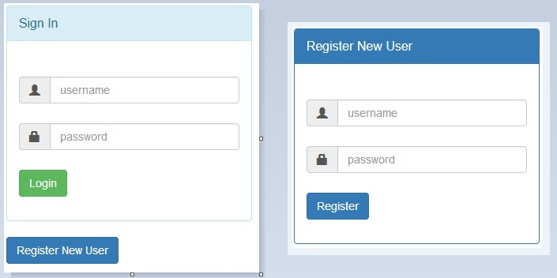
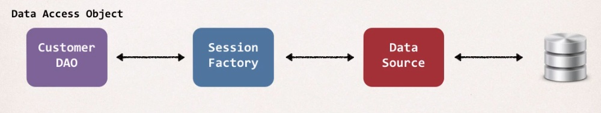

# SpringDbWebApp
Complete Database Web App with Spring MVC, Spring Security, Hibernate, Bootstrap, Maven and more 

The web app was deployed on AWS Cloud --> [Spring Database Web App]( spring-security.us-east-2.elasticbeanstalk.com )

This project is based on:
-	Spring core
-	Spring java configuration
-	Spring mvc
-	Spring security (with password encryption in the database)
-	Hibernate CRUD
-	Maven
-	Bootstrap
-	MYSQL Database
-	And more

This web app use Spring and Hibernate, integrate them together and have a full working app that talks to the MySQL database. 

The CRM app has a login page. Only users with valid id/passwords will be able to login. The app will also restrict 
access based on roles.

A new user can easily register, filling username and password fields. After submitting form, the data will be stored 
in the database table. So that next time user can login with the login credentials which are used while user registration.

CRM – Customer Relationship Management – this app will allow you to track customers, add new customers, update, delete, 
search for a customer and also list all the customers in the database. 

Employee role: users in this role will only be allowed to list customers.  Manager role: users in this role will be allowed to list, 
add and update customers.  Admin role: users in this role will be allowed to list, add, update and delete customers.

There are 3 users in the database:

1.	john • user id: john • password: fun123 • Role: employee 
2.	mary • user id: mary • password: fun123 • Role: employee, manager 
3.	susan • user id: susan • password: fun123 • Role: employee, admin

**DAO Layer - Data Access Object Desing Pattern**

I’ll make use of a customer data acces object (DAO). This is basically responsible for interfacing with the database. 
This is a very common design pattern that’s used in the industry. It’s really just a helper class or utility class for talking 
to the database. This DAO will actually make use of the Hibernate API for accessing the data and then sending it back to whoever 
called the method, and it this case will be Spring MVC customer controller. 

When you use HIbernate, the DAO actually needs a Hibernate Session Factory, you need to get a Session Factory over to the DAO, 
and the the Session Factory actually needs a Data Source, so the Data Source actually defines the database connection information,
so it’ll tell you how to connect to the database, user id, password, etc. 

**Dependency Injection**

All these are dependencies and I’ll wire them together with dependency injection (DI). The Spring container is configured using 
Java code. It is a pure Java configuration, there’s actually no use of XML to configure the Spring container.

**Service Layer - Service Facade design pattern**

The purpose of Service Layer is to integrate multiple data sources. The service layer sits between the customer controller and 
the customer DAO. The service layer is actually an implementation of the service façade design pattern. It’s an intermediate 
layer for the custom business logic. It is used to integrate data from multiple sources.  

**The Big Picture**

The browser will make a request to the Customer Controller. The Customer Controller is gonna make use of this intermediate layer, the Customer Service, then the Customer Service will call the Customer DAO. This DAO will actually access the database using the Hibernate API. Then we’ll get the data back from the database and then the controller will place that into the Spring MVC model and then send that over to the JSP pages. And then finally, the JSP pages will render that data to the screen. 

   
 
**Spring Security Login Proccess**

Spring Security defines a framework for security. It’s implemented using Servlet filters in the background. 

There is a login form and a database that has encrypted passwords. Also there are these Spring Security Filters in place. 
The users will enter their plain text password on the form and hit login, so then behind the scenes the Spring Security 
filters will read this information and perform some operations on it using JDBC authentication.

What happens behind the scenes:
1.	Retrieve password from db for the user;
2.	Read the encoding algorithm id, like bcrypt;
3.	For the case of Bcrypt, encrypt plaintext password from login form (using salt from db password);
4.	Compare encrypted password from login form with encrypted password from db;
5.	If there is a match, login successful;
6.	If no match, login fails; 

One thing is very important here, the password from db is never decrypted, because BCrypt is a one way encryption algorithm, 
so we never grab the password from the database and decrypt it and have it as plain text, because that algorithm just doesn’t 
support that. 

This is the structure of the app:

